# Design Document: Authentication

## Overview

This design implements a complete authentication system using Supabase as the identity provider. The backend handles user signup, email verification, login, and logout, while also validating JWT tokens for protected routes. The system provides FastAPI endpoints for all authentication flows and dependency injection for route protection.

## Steering Document Alignment

### Technical Standards (tech.md)

- Uses python-jose for JWT operations as specified
- Integrates with Supabase Auth via JWT verification
- Follows FastAPI dependency injection patterns
- Uses Pydantic v2 for schema definitions

### Project Structure (structure.md)

- Auth middleware in `src/api/middleware/auth.py`
- Auth routes in `src/api/routes/auth.py`
- Auth service in `src/services/auth_service.py`
- Dependencies in `src/api/deps.py`
- Schemas in `src/schemas/auth.py`
- Follows snake_case for modules, PascalCase for classes

## Code Reuse Analysis

### Existing Components to Leverage

- **src/core/config.py**: Settings for Supabase URL, JWT secret, and redirect URLs
- **src/core/supabase.py**: Supabase client for auth operations
- **src/schemas/common.py**: ErrorResponse schema for auth errors
- **src/api/middleware/error_handler.py**: Exception handling patterns
- **src/services/profile_service.py**: Profile creation after signup

### Integration Points

- **Supabase Auth**: Handles user signup, login, email verification, and session management
- **Protected Routes**: All routes using `get_current_user` dependency
- **Profile Service**: Auto-creates profiles via database trigger on user signup
- **Email Templates**: Supabase email templates configured with redirect URLs

## Architecture

```mermaid
graph TD
    subgraph "Signup Flow"
        A1[POST /auth/signup] --> A2[AuthService.signup]
        A2 --> A3[Supabase Auth.sign_up]
        A3 --> A4[Send Verification Email]
        A4 --> A5[Return user_id + email_sent]
        A3 --> A6[Database Trigger]
        A6 --> A7[Auto-create Profile]
    end

    subgraph "Verification Flow"
        B1[GET/POST /auth/verify-email] --> B2[AuthService.verify_email]
        B2 --> B3[Supabase Auth.verify_otp]
        B3 --> B4[Mark Email Verified]
        B4 --> B5[Return redirect_url]
    end

    subgraph "Login Flow"
        C1[POST /auth/login] --> C2[AuthService.login]
        C2 --> C3[Supabase Auth.sign_in_with_password]
        C3 --> C4[Return JWT Tokens]
    end

    subgraph "Password Reset Flow"
        F1[POST /auth/forgot-password] --> F2[AuthService.request_password_reset]
        F2 --> F3[Supabase Auth.reset_password_for_email]
        F3 --> F4[Send Reset Email]
        F5[POST /auth/reset-password] --> F6[AuthService.reset_password]
        F6 --> F7[Supabase Auth.verify_otp + update_user]
        F7 --> F8[Password Updated]
    end

    subgraph "Change Password Flow"
        G1[POST /auth/change-password] --> G2[AuthService.change_password]
        G2 --> G3[Verify Current Password]
        G3 --> G4[Supabase Auth.update_user]
        G4 --> G5[Password Changed]
    end

    subgraph "Refresh Token Flow"
        H1[POST /auth/refresh] --> H2[AuthService.refresh_token]
        H2 --> H3[Supabase Auth.refresh_session]
        H3 --> H4[Return New Tokens]
    end

    subgraph "Protected Route Flow"
        D1[HTTP Request] --> D2{Has Auth Header?}
        D2 -->|No| D3[Return 401]
        D2 -->|Yes| D4[Extract Token]
        D4 --> D5[Verify JWT]
        D5 -->|Invalid| D6[Return 401]
        D5 -->|Valid| D7[Extract User Context]
        D7 --> D8[Inject into Route]
        D8 --> D9[Route Handler]
    end

    subgraph "JWT Verification"
        D5 --> E1[Check Signature]
        E1 --> E2[Check Expiration]
        E2 --> E3[Check Issuer]
        E3 --> E4[Decode Claims]
    end
```



## Components and Interfaces

### Component 1: Auth Schemas (`src/schemas/auth.py`)

- **Purpose:** Define user context, auth request/response schemas, and token payloads
- **Interfaces:**
  ```python
  class UserContext(BaseModel):
      user_id: UUID
      email: str | None = None
      role: str | None = None

  class TokenPayload(BaseModel):
      sub: str  # user_id
      email: str | None = None
      role: str | None = None
      exp: int
      iat: int

  class SignupRequest(BaseModel):
      email: str
      password: str
      display_name: str | None = None

  class SignupResponse(BaseModel):
      user_id: str
      email: str
      email_sent: bool
      message: str

  class LoginRequest(BaseModel):
      email: str
      password: str

  class LoginResponse(BaseModel):
      access_token: str
      refresh_token: str | None
      user_id: str
      email: str
      expires_in: int

  class VerifyEmailRequest(BaseModel):
      token: str
      token_hash: str | None = None

  class VerifyEmailResponse(BaseModel):
      verified: bool
      message: str
      redirect_url: str | None

  class ResendVerificationRequest(BaseModel):
      email: str

  class ResendVerificationResponse(BaseModel):
      email_sent: bool
      message: str

  class ForgotPasswordRequest(BaseModel):
      email: str

  class ForgotPasswordResponse(BaseModel):
      message: str
      email_sent: bool

  class ResetPasswordRequest(BaseModel):
      token: str
      new_password: str

  class ResetPasswordResponse(BaseModel):
      message: str
      redirect_url: str | None

  class ChangePasswordRequest(BaseModel):
      current_password: str
      new_password: str

  class ChangePasswordResponse(BaseModel):
      message: str

  class RefreshTokenRequest(BaseModel):
      refresh_token: str

  class RefreshTokenResponse(BaseModel):
      access_token: str
      refresh_token: str | None
      expires_in: int
  ```
- **Dependencies:** pydantic
- **Reuses:** N/A

### Component 2: JWT Verification Utilities (`src/api/middleware/auth.py`)

- **Purpose:** Decode and validate Supabase JWTs
- **Interfaces:**
  ```python
  def decode_jwt(token: str) -> TokenPayload:
      """Decode and validate JWT, raises AuthError if invalid"""

  class AuthError(Exception):
      """Authentication error with specific code"""
      code: str  # UNAUTHORIZED, TOKEN_EXPIRED, INVALID_TOKEN
      message: str
  ```
- **Dependencies:** python-jose, src/core/config.py
- **Reuses:** Settings from config

### Component 3: Authentication Service (`src/services/auth_service.py`)

- **Purpose:** Business logic for authentication operations (signup, login, verification)
- **Interfaces:**
  ```python
  class AuthService:
      async def signup(
          email: str,
          password: str,
          display_name: str | None = None
      ) -> dict[str, Any]:
          """Sign up new user with email and password"""

      async def verify_email(
          token: str,
          token_hash: str | None = None
      ) -> dict[str, Any]:
          """Verify user email with verification token"""

      async def resend_verification_email(
          email: str
      ) -> dict[str, Any]:
          """Resend verification email"""

      async def login(
          email: str,
          password: str
      ) -> dict[str, Any]:
          """Login user with email and password"""

      async def logout(
          access_token: str
      ) -> dict[str, Any]:
          """Logout user and invalidate session"""

      async def request_password_reset(
          email: str
      ) -> dict[str, Any]:
          """Send password reset email to user"""

      async def reset_password(
          token: str,
          new_password: str
      ) -> dict[str, Any]:
          """Reset user password with token from email"""

      async def change_password(
          user_id: UUID,
          current_password: str,
          new_password: str
      ) -> dict[str, Any]:
          """Change password for authenticated user"""

      async def refresh_token(
          refresh_token: str
      ) -> dict[str, Any]:
          """Refresh access token using refresh token"""
  ```
- **Dependencies:** src/core/supabase.py, src/core/config.py
- **Reuses:** Supabase client, Settings configuration

### Component 4: Authentication Routes (`src/api/routes/auth.py`)

- **Purpose:** FastAPI endpoints for authentication operations
- **Interfaces:**
  ```python
  @router.post("/signup") -> SignupResponse
  @router.post("/login") -> LoginResponse
  @router.post("/verify-email") -> VerifyEmailResponse
  @router.get("/verify-email") -> VerifyEmailResponse
  @router.post("/resend-verification") -> ResendVerificationResponse
  @router.post("/forgot-password") -> ForgotPasswordResponse
  @router.post("/reset-password") -> ResetPasswordResponse
  @router.get("/reset-password") -> ResetPasswordResponse
  @router.post("/change-password") -> ChangePasswordResponse
  @router.post("/refresh") -> RefreshTokenResponse
  @router.post("/logout") -> dict
  @router.get("/me") -> dict
  ```
- **Dependencies:** src/services/auth_service.py, src/schemas/auth.py
- **Reuses:** AuthService for business logic

### Component 5: Authentication Dependencies (`src/api/deps.py`)

- **Purpose:** FastAPI dependency injection for user context
- **Interfaces:**
  ```python
  async def get_current_user(
      authorization: str = Header(None)
  ) -> UserContext:
      """Extract and validate user from Authorization header"""

  async def get_optional_user(
      authorization: str = Header(None)
  ) -> UserContext | None:
      """Same as get_current_user but returns None if no auth"""
  ```
- **Dependencies:** src/api/middleware/auth.py, src/schemas/auth.py
- **Reuses:** decode_jwt from auth middleware

## Data Models

### UserContext Schema

```python
class UserContext(BaseModel):
    """Authenticated user context available in protected routes"""
    user_id: UUID
    email: str | None = None
    role: str | None = None

    model_config = ConfigDict(frozen=True)
```

### TokenPayload Schema

```python
class TokenPayload(BaseModel):
    """Decoded JWT payload from Supabase"""
    sub: str
    email: str | None = None
    role: str | None = None
    exp: int
    iat: int
    aud: str | None = None
    iss: str | None = None
```

## Error Handling

### Error Scenarios

1. **Missing Authorization Header**
   - **Handling:** Raise HTTPException 401 with code "UNAUTHORIZED"
   - **User Impact:** `{"error": {"code": "UNAUTHORIZED", "message": "Authorization header required"}}`

2. **Malformed Authorization Header**
   - **Handling:** Raise HTTPException 401 with code "INVALID_TOKEN"
   - **User Impact:** `{"error": {"code": "INVALID_TOKEN", "message": "Invalid authorization header format"}}`

3. **Expired Token**
   - **Handling:** Raise HTTPException 401 with code "TOKEN_EXPIRED"
   - **User Impact:** `{"error": {"code": "TOKEN_EXPIRED", "message": "Token has expired, please refresh"}}`

4. **Invalid Token Signature**
   - **Handling:** Raise HTTPException 401 with code "INVALID_TOKEN"
   - **User Impact:** `{"error": {"code": "INVALID_TOKEN", "message": "Token signature verification failed"}}`

## Testing Strategy

### Unit Testing

- Test `decode_jwt()` with valid token returns TokenPayload
- Test `decode_jwt()` with expired token raises AuthError
- Test `decode_jwt()` with invalid signature raises AuthError
- Test `get_current_user()` extracts UserContext correctly
- Test `get_optional_user()` returns None for missing auth

### Integration Testing

- Test protected endpoint returns 401 without auth header
- Test protected endpoint returns 401 with expired token
- Test protected endpoint returns 200 with valid token
- Test user_id is correctly passed to route handler

### End-to-End Testing

- Test full auth flow with real Supabase token
- Test token refresh scenario

## Configuration

### Environment Variables

- `AUTH_REDIRECT_URL` (required): Redirect URL after email verification
  - Example: `https://autopilot-marketplace-discovery-to.vercel.app`
  - Used in verification email links
  - Must be configured per environment (dev/staging/prod)

- `SUPABASE_URL` (required): Supabase project URL
- `SUPABASE_SECRET_KEY` (required): Supabase service role key
- `SUPABASE_SIGNING_KEY_JWK` (required): JWT signing key for token verification

### Supabase Dashboard Configuration

1. **Email Templates**: Configure verification email template with `{{ .ConfirmationURL }}`
2. **Site URL**: Set to match `AUTH_REDIRECT_URL`
3. **Redirect URLs**: Add allowed redirect URLs including `AUTH_REDIRECT_URL/**`

## File Manifest

| File | Purpose |
|------|---------|
| `src/schemas/auth.py` | Auth request/response schemas, UserContext, TokenPayload |
| `src/api/middleware/auth.py` | JWT decoding and validation utilities |
| `src/api/routes/auth.py` | Authentication API endpoints (signup, login, password reset, change password, refresh) |
| `src/services/auth_service.py` | Authentication business logic (all auth operations) |
| `src/api/deps.py` | FastAPI dependencies for auth |
| `src/core/config.py` | Configuration including AUTH_REDIRECT_URL |
| `src/main.py` | Router registration |
| `tests/unit/test_auth.py` | Unit tests for auth components |
| `tests/integration/test_auth_routes.py` | Integration tests for auth endpoints |
