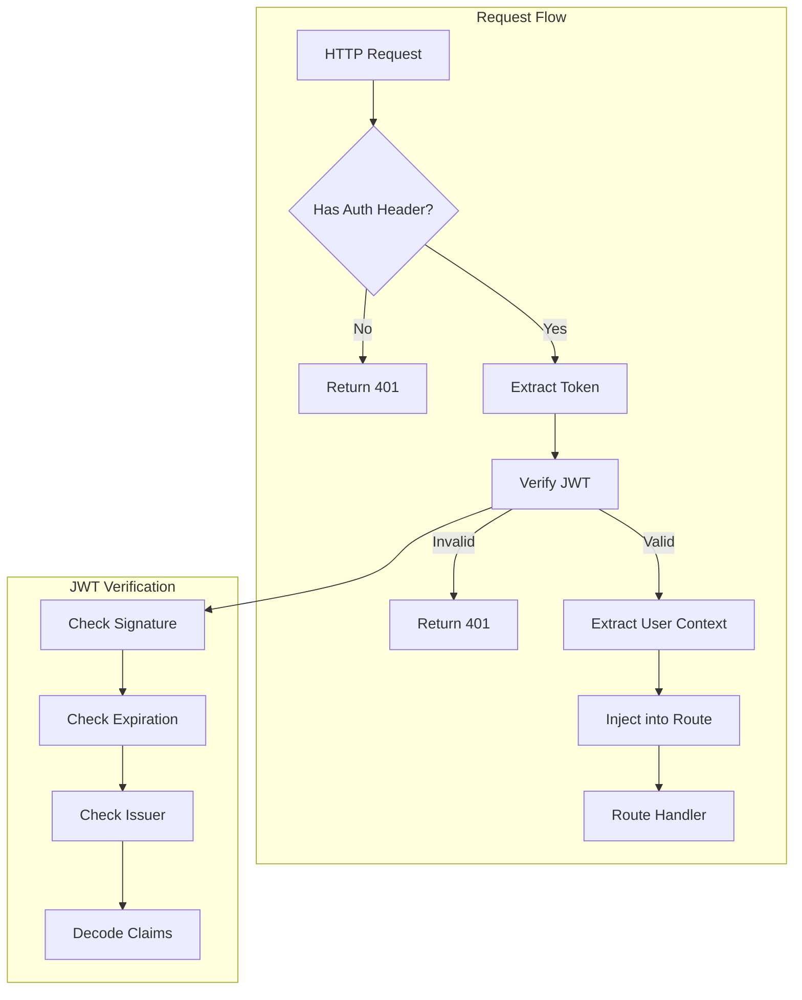

# Design Document: Authentication

## Overview

This design implements JWT-based authentication using Supabase as the identity provider. The authentication layer validates tokens issued by Supabase, extracts user context, and provides FastAPI dependency injection for protected routes. This is a verification-only layer; Supabase handles actual authentication flows (login, signup, password reset).

## Steering Document Alignment

### Technical Standards (tech.md)

- Uses python-jose for JWT operations as specified
- Integrates with Supabase Auth via JWT verification
- Follows FastAPI dependency injection patterns
- Uses Pydantic v2 for schema definitions

### Project Structure (structure.md)

- Auth middleware in `src/api/middleware/auth.py`
- Dependencies in `src/api/deps.py`
- Schemas in `src/schemas/auth.py`
- Follows snake_case for modules, PascalCase for classes

## Code Reuse Analysis

### Existing Components to Leverage

- **src/core/config.py**: Settings for Supabase URL and JWT secret
- **src/core/supabase.py**: Supabase client for user verification
- **src/schemas/common.py**: ErrorResponse schema for auth errors
- **src/api/middleware/error_handler.py**: Exception handling patterns

### Integration Points

- **Supabase Auth**: Validates JWTs issued by Supabase Auth service
- **Protected Routes**: All routes using `get_current_user` dependency
- **Profile Service**: Uses user_id from context to fetch/create profiles

## Architecture



## Components and Interfaces

### Component 1: Auth Schemas (`src/schemas/auth.py`)

- **Purpose:** Define user context and auth-related data structures
- **Interfaces:**
  ```python
  class UserContext(BaseModel):
      user_id: UUID
      email: str | None = None
      role: str | None = None

  class TokenPayload(BaseModel):
      sub: str  # user_id
      email: str | None = None
      role: str | None = None
      exp: int
      iat: int
  ```
- **Dependencies:** pydantic
- **Reuses:** N/A

### Component 2: JWT Verification Utilities (`src/api/middleware/auth.py`)

- **Purpose:** Decode and validate Supabase JWTs
- **Interfaces:**
  ```python
  def decode_jwt(token: str) -> TokenPayload:
      """Decode and validate JWT, raises AuthError if invalid"""

  class AuthError(Exception):
      """Authentication error with specific code"""
      code: str  # UNAUTHORIZED, TOKEN_EXPIRED, INVALID_TOKEN
      message: str
  ```
- **Dependencies:** python-jose, src/core/config.py
- **Reuses:** Settings from config

### Component 3: Authentication Dependencies (`src/api/deps.py`)

- **Purpose:** FastAPI dependency injection for user context
- **Interfaces:**
  ```python
  async def get_current_user(
      authorization: str = Header(None)
  ) -> UserContext:
      """Extract and validate user from Authorization header"""

  async def get_optional_user(
      authorization: str = Header(None)
  ) -> UserContext | None:
      """Same as get_current_user but returns None if no auth"""
  ```
- **Dependencies:** src/api/middleware/auth.py, src/schemas/auth.py
- **Reuses:** decode_jwt from auth middleware

## Data Models

### UserContext Schema

```python
class UserContext(BaseModel):
    """Authenticated user context available in protected routes"""
    user_id: UUID
    email: str | None = None
    role: str | None = None

    model_config = ConfigDict(frozen=True)
```

### TokenPayload Schema

```python
class TokenPayload(BaseModel):
    """Decoded JWT payload from Supabase"""
    sub: str
    email: str | None = None
    role: str | None = None
    exp: int
    iat: int
    aud: str | None = None
    iss: str | None = None
```

## Error Handling

### Error Scenarios

1. **Missing Authorization Header**
   - **Handling:** Raise HTTPException 401 with code "UNAUTHORIZED"
   - **User Impact:** `{"error": {"code": "UNAUTHORIZED", "message": "Authorization header required"}}`

2. **Malformed Authorization Header**
   - **Handling:** Raise HTTPException 401 with code "INVALID_TOKEN"
   - **User Impact:** `{"error": {"code": "INVALID_TOKEN", "message": "Invalid authorization header format"}}`

3. **Expired Token**
   - **Handling:** Raise HTTPException 401 with code "TOKEN_EXPIRED"
   - **User Impact:** `{"error": {"code": "TOKEN_EXPIRED", "message": "Token has expired, please refresh"}}`

4. **Invalid Token Signature**
   - **Handling:** Raise HTTPException 401 with code "INVALID_TOKEN"
   - **User Impact:** `{"error": {"code": "INVALID_TOKEN", "message": "Token signature verification failed"}}`

## Testing Strategy

### Unit Testing

- Test `decode_jwt()` with valid token returns TokenPayload
- Test `decode_jwt()` with expired token raises AuthError
- Test `decode_jwt()` with invalid signature raises AuthError
- Test `get_current_user()` extracts UserContext correctly
- Test `get_optional_user()` returns None for missing auth

### Integration Testing

- Test protected endpoint returns 401 without auth header
- Test protected endpoint returns 401 with expired token
- Test protected endpoint returns 200 with valid token
- Test user_id is correctly passed to route handler

### End-to-End Testing

- Test full auth flow with real Supabase token
- Test token refresh scenario

## File Manifest

| File | Purpose |
|------|---------|
| `src/schemas/auth.py` | UserContext and TokenPayload schemas |
| `src/api/middleware/auth.py` | JWT decoding and validation utilities |
| `src/api/deps.py` | FastAPI dependencies for auth |
| `tests/unit/test_auth.py` | Unit tests for auth components |
| `tests/integration/test_auth_routes.py` | Integration tests for protected routes |
