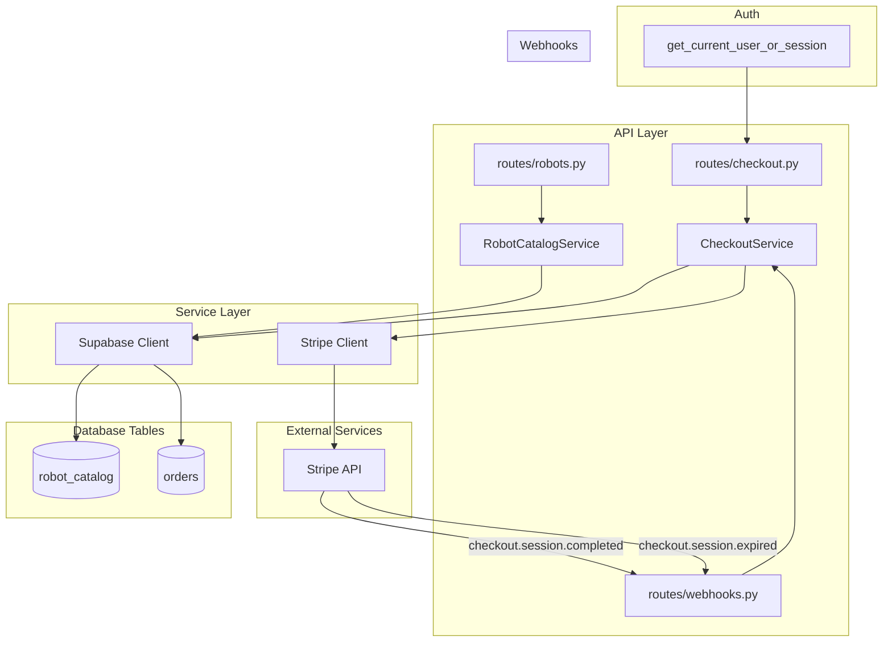
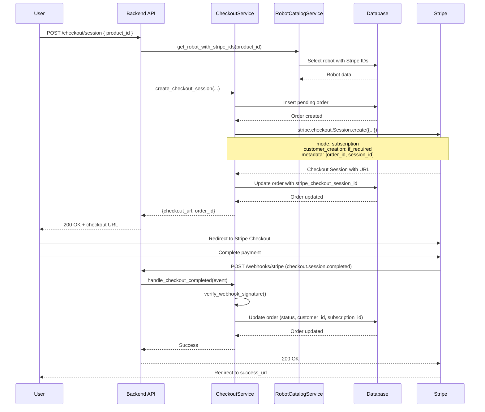

# Design Document: Checkout & Stripe Integration

## Overview

This design implements the robot product catalog, Stripe subscription checkout, and order management system. It enables users to browse robot products aligned with the frontend `RobotOption` interface, create Stripe Checkout Sessions for monthly leases, and track orders through completion via webhooks.

## Steering Document Alignment

### Technical Standards (tech.md)

- Uses Stripe Python SDK for payment processing
- Stores data in Supabase PostgreSQL
- Uses async/await where possible (Stripe SDK is sync)
- Follows layered architecture (routes -> services -> models)

### Project Structure (structure.md)

- Stripe client in `src/core/stripe.py`
- Models in `src/models/` for database representations
- Schemas in `src/schemas/` for API contracts
- Services in `src/services/` for business logic
- Routes in `src/api/routes/` for HTTP endpoints

## Code Reuse Analysis

### Existing Components to Leverage

- **src/api/deps.py**: Use dual auth dependency from sessions-discovery spec
- **src/core/supabase.py**: Supabase client for database operations
- **src/core/config.py**: Extend with Stripe configuration
- **src/schemas/common.py**: ErrorResponse schema for errors
- **src/services/session_service.py**: Session lookup for order linking

### Integration Points

- **Sessions**: Link orders to sessions for guest checkout
- **Profiles**: Link orders to profiles for authenticated users
- **Discovery**: Product selections from discovery flow

## Architecture



## Components and Interfaces

### Component 1: Stripe Client Singleton (`src/core/stripe.py`)

- **Purpose:** Provide configured Stripe client
- **Interfaces:**
  ```python
  import stripe

  def configure_stripe() -> None:
      """Configure Stripe SDK with API key"""
      stripe.api_key = settings.stripe_secret_key

  def get_stripe() -> stripe:
      """Return configured Stripe module"""
      return stripe
  ```
- **Dependencies:** stripe SDK, src/core/config.py
- **Reuses:** Settings for API key

### Component 2: Robot Schemas (`src/schemas/robot.py`)

- **Purpose:** Define robot catalog request/response contracts aligned with frontend
- **Interfaces:**
  ```python
  class RobotResponse(BaseModel):
      id: UUID
      name: str
      category: str
      best_for: str | None
      modes: list[str]
      surfaces: list[str]
      monthly_lease: Decimal
      purchase_price: Decimal
      time_efficiency: Decimal
      key_reasons: list[str]
      specs: list[str]
      image_url: str | None
      active: bool

      # Computed for frontend compatibility
      @computed_field
      @property
      def monthlyLease(self) -> float:
          return float(self.monthly_lease)

      @computed_field
      @property
      def purchasePrice(self) -> float:
          return float(self.purchase_price)

      @computed_field
      @property
      def timeEfficiency(self) -> float:
          return float(self.time_efficiency)

      @computed_field
      @property
      def bestFor(self) -> str | None:
          return self.best_for

      @computed_field
      @property
      def keyReasons(self) -> list[str]:
          return self.key_reasons

  class RobotListResponse(BaseModel):
      items: list[RobotResponse]
  ```
- **Dependencies:** pydantic
- **Reuses:** N/A

### Component 3: Checkout Schemas (`src/schemas/checkout.py`)

- **Purpose:** Define checkout request/response contracts
- **Interfaces:**
  ```python
  class CheckoutSessionCreate(BaseModel):
      product_id: UUID
      success_url: str
      cancel_url: str
      customer_email: str | None = None

  class CheckoutSessionResponse(BaseModel):
      checkout_url: str
      order_id: UUID
      stripe_session_id: str

  class OrderResponse(BaseModel):
      id: UUID
      profile_id: UUID | None
      session_id: UUID | None
      status: str
      line_items: list[dict]
      total_cents: int
      currency: str
      customer_email: str | None
      stripe_subscription_id: str | None
      completed_at: datetime | None
      created_at: datetime

  class OrderListResponse(BaseModel):
      items: list[OrderResponse]
  ```
- **Dependencies:** pydantic
- **Reuses:** N/A

### Component 4: Robot Catalog Service (`src/services/robot_catalog_service.py`)

- **Purpose:** Business logic for robot catalog operations
- **Interfaces:**
  ```python
  class RobotCatalogService:
      async def list_robots(self, active_only: bool = True) -> list[dict]:
          """List all robots in catalog"""

      async def get_robot(self, robot_id: UUID) -> dict | None:
          """Get single robot by ID"""

      async def get_robot_with_stripe_ids(self, robot_id: UUID) -> dict | None:
          """Get robot including Stripe product/price IDs"""
  ```
- **Dependencies:** src/core/supabase.py
- **Reuses:** Supabase client

### Component 5: Checkout Service (`src/services/checkout_service.py`)

- **Purpose:** Business logic for Stripe checkout and order management
- **Interfaces:**
  ```python
  class CheckoutService:
      async def create_checkout_session(
          self,
          product_id: UUID,
          success_url: str,
          cancel_url: str,
          profile_id: UUID | None = None,
          session_id: UUID | None = None,
          customer_email: str | None = None,
      ) -> dict:
          """Create Stripe Checkout Session and pending order"""

      async def handle_checkout_completed(self, event: dict) -> dict:
          """Process checkout.session.completed webhook"""

      async def handle_checkout_expired(self, event: dict) -> None:
          """Process checkout.session.expired webhook"""

      async def get_order(self, order_id: UUID) -> dict | None:
          """Get order by ID"""

      async def get_orders_for_profile(self, profile_id: UUID) -> list[dict]:
          """Get all orders for a profile"""

      async def get_orders_for_session(self, session_id: UUID) -> list[dict]:
          """Get all orders for a session"""

      async def transfer_orders_to_profile(
          self, session_id: UUID, profile_id: UUID
      ) -> int:
          """Transfer session orders to profile, return count"""

      def verify_webhook_signature(
          self, payload: bytes, sig_header: str
      ) -> dict:
          """Verify Stripe webhook signature and return event"""
  ```
- **Dependencies:** src/core/stripe.py, src/core/supabase.py, src/services/robot_catalog_service.py
- **Reuses:** Stripe client, Supabase client

## Data Models

### Database Schema

```sql
-- Robot catalog table (aligned with frontend RobotOption)
CREATE TABLE robot_catalog (
    id UUID PRIMARY KEY DEFAULT gen_random_uuid(),
    name VARCHAR(255) NOT NULL,
    category VARCHAR(100) NOT NULL,
    best_for TEXT,
    modes TEXT[] NOT NULL DEFAULT '{}',
    surfaces TEXT[] NOT NULL DEFAULT '{}',
    monthly_lease DECIMAL(10,2) NOT NULL,
    purchase_price DECIMAL(10,2) NOT NULL,
    time_efficiency DECIMAL(3,2) NOT NULL
        CHECK (time_efficiency >= 0 AND time_efficiency <= 1),
    key_reasons TEXT[] NOT NULL DEFAULT '{}',
    specs TEXT[] NOT NULL DEFAULT '{}',
    image_url TEXT,
    stripe_product_id VARCHAR(255) NOT NULL,
    stripe_lease_price_id VARCHAR(255) NOT NULL,
    active BOOLEAN NOT NULL DEFAULT true,
    created_at TIMESTAMPTZ NOT NULL DEFAULT NOW(),
    updated_at TIMESTAMPTZ NOT NULL DEFAULT NOW()
);

-- Indexes
CREATE INDEX idx_robot_catalog_active ON robot_catalog(active);
CREATE INDEX idx_robot_catalog_category ON robot_catalog(category);

-- Seed data (5 robots from frontend catalog)
INSERT INTO robot_catalog (name, category, best_for, modes, surfaces, monthly_lease, purchase_price, time_efficiency, key_reasons, specs, stripe_product_id, stripe_lease_price_id) VALUES
('Pudu CC1 Pro', 'Premium Combo', 'Indoor courts, wet cleaning', ARRAY['Vacuum', 'Wet Scrub', 'Dry Sweep'], ARRAY['CushionX', 'Asphalt', 'Acrylic'], 1200.00, 28000.00, 0.85, ARRAY['Required wet cleaning support', 'Indoor court optimization', 'High nightly throughput'], ARRAY['4-in-1 Cleaning', '12h Runtime', 'Auto-docking'], 'prod_pudu_cc1_pro', 'price_pudu_cc1_pro_monthly'),
('Pudu MT1 Vac', 'Commercial Vacuum', 'Outdoor courts', ARRAY['Vacuum'], ARRAY['Asphalt', 'Concrete'], 950.00, 18000.00, 0.75, ARRAY['Industrial suction power', 'Large debris handling', 'Rugged outdoor build'], ARRAY['Vacuum Only', '15h Runtime', 'Dust Filtration'], 'prod_pudu_mt1_vac', 'price_pudu_mt1_vac_monthly'),
('MaxBattery Pro', 'Heavy Duty', 'Large facilities', ARRAY['Vacuum', 'Scrub'], ARRAY['Concrete', 'Wood'], 1400.00, 35000.00, 0.90, ARRAY['Highest battery capacity', '24/7 Operations support', 'Extreme coverage area'], ARRAY['20h Runtime', 'Dual Batteries', 'Fast Charging'], 'prod_max_battery_pro', 'price_max_battery_pro_monthly'),
('FoodRunner V2', 'Hospitality Hybrid', 'Facilities with F&B', ARRAY['Vacuum', 'Debris'], ARRAY['Carpet', 'Hard Floor'], 1100.00, 22000.00, 0.65, ARRAY['Maneuverability in tight spaces', 'Cross-surface transition', 'Quiet operation'], ARRAY['Small Footprint', 'Quiet Mode', 'Tray Support'], 'prod_foodrunner_v2', 'price_foodrunner_v2_monthly'),
('BudgetVac Mini', 'Value Entry', 'Cost-sensitive buyers', ARRAY['Vacuum'], ARRAY['Smooth Hard Floors'], 700.00, 12000.00, 0.55, ARRAY['Lowest entry cost', 'Simple maintenance', 'Quick setup'], ARRAY['Compact', 'Manual Battery Swap', 'Lightweight'], 'prod_budgetvac_mini', 'price_budgetvac_mini_monthly');
```

```sql
-- Order status and type enums
CREATE TYPE order_status AS ENUM ('pending', 'processing', 'completed', 'cancelled', 'refunded');

-- Orders table
CREATE TABLE orders (
    id UUID PRIMARY KEY DEFAULT gen_random_uuid(),
    profile_id UUID REFERENCES profiles(id) ON DELETE SET NULL,
    session_id UUID REFERENCES sessions(id) ON DELETE SET NULL,
    stripe_checkout_session_id VARCHAR(255) NOT NULL UNIQUE,
    stripe_customer_id VARCHAR(255),
    stripe_subscription_id VARCHAR(255),
    status order_status NOT NULL DEFAULT 'pending',
    line_items JSONB NOT NULL,
    total_cents INTEGER NOT NULL,
    currency VARCHAR(3) NOT NULL DEFAULT 'usd',
    customer_email VARCHAR(255),
    metadata JSONB DEFAULT '{}',
    completed_at TIMESTAMPTZ,
    created_at TIMESTAMPTZ NOT NULL DEFAULT NOW(),
    updated_at TIMESTAMPTZ NOT NULL DEFAULT NOW(),

    -- Ensure order has an owner
    CONSTRAINT chk_order_owner CHECK (profile_id IS NOT NULL OR session_id IS NOT NULL)
);

-- Indexes
CREATE INDEX idx_orders_profile_id ON orders(profile_id);
CREATE INDEX idx_orders_session_id ON orders(session_id);
CREATE INDEX idx_orders_stripe_checkout_session_id ON orders(stripe_checkout_session_id);
CREATE INDEX idx_orders_status ON orders(status);
CREATE INDEX idx_orders_created_at ON orders(created_at DESC);
```

### Row-Level Security Policies

```sql
-- Robot catalog: publicly readable
ALTER TABLE robot_catalog ENABLE ROW LEVEL SECURITY;

CREATE POLICY robot_catalog_select ON robot_catalog
    FOR SELECT USING (true);

-- Orders: users can read their own orders
ALTER TABLE orders ENABLE ROW LEVEL SECURITY;

CREATE POLICY orders_select ON orders
    FOR SELECT USING (
        profile_id IN (SELECT id FROM profiles WHERE user_id = auth.uid())
    );

-- Note: Session-based order access is handled in service layer
-- (service uses secret key, bypasses RLS)
```

## Stripe Checkout Flow



## Webhook Event Handling

### checkout.session.completed

```python
{
    "id": "evt_...",
    "type": "checkout.session.completed",
    "data": {
        "object": {
            "id": "cs_...",
            "customer": "cus_...",
            "subscription": "sub_...",
            "metadata": {
                "order_id": "uuid",
                "session_id": "uuid"
            },
            "customer_details": {
                "email": "user@example.com"
            }
        }
    }
}
```

**Processing:**
1. Verify webhook signature
2. Extract order_id from metadata
3. Update order: status='completed', stripe_customer_id, stripe_subscription_id, customer_email, completed_at
4. Return 200 OK

### checkout.session.expired

```python
{
    "id": "evt_...",
    "type": "checkout.session.expired",
    "data": {
        "object": {
            "id": "cs_...",
            "metadata": {
                "order_id": "uuid"
            }
        }
    }
}
```

**Processing:**
1. Verify webhook signature
2. Extract order_id from metadata
3. Update order: status='cancelled'
4. Return 200 OK

## Error Handling

### Error Scenarios

1. **Robot Not Found**
   - **Handling:** Return 404 Not Found
   - **User Impact:** `{"error": {"code": "NOT_FOUND", "message": "Robot not found"}}`

2. **Robot Inactive**
   - **Handling:** Return 400 Bad Request
   - **User Impact:** `{"error": {"code": "PRODUCT_UNAVAILABLE", "message": "This product is no longer available"}}`

3. **Stripe Checkout Creation Failed**
   - **Handling:** Log error, return 503 Service Unavailable
   - **User Impact:** `{"error": {"code": "CHECKOUT_FAILED", "message": "Unable to create checkout session"}}`

4. **Invalid Webhook Signature**
   - **Handling:** Return 400 Bad Request, log attempt
   - **User Impact:** N/A (Stripe-facing endpoint)

5. **Order Not Found**
   - **Handling:** Return 404 Not Found
   - **User Impact:** `{"error": {"code": "NOT_FOUND", "message": "Order not found"}}`

6. **Order Access Denied**
   - **Handling:** Return 403 Forbidden
   - **User Impact:** `{"error": {"code": "FORBIDDEN", "message": "You don't have access to this order"}}`

## Configuration

```python
# Add to src/core/config.py
class Settings(BaseSettings):
    # ... existing settings ...

    # Stripe
    stripe_secret_key: str = Field(..., description="Stripe secret API key")
    stripe_webhook_secret: str = Field(..., description="Stripe webhook signing secret")
    stripe_publishable_key: str = Field(..., description="Stripe publishable key")
```

## Testing Strategy

### Unit Testing

- Test RobotCatalogService.list_robots returns active products
- Test CheckoutService.create_checkout_session creates order and returns URL
- Test CheckoutService.verify_webhook_signature rejects invalid signatures
- Test CheckoutService.handle_checkout_completed updates order correctly

### Integration Testing

- Test GET /robots returns catalog
- Test GET /robots/{id} returns single robot
- Test POST /checkout/session creates Stripe session
- Test POST /webhooks/stripe updates order on completion
- Test GET /orders/{id} returns order for owner

### End-to-End Testing

- Test complete checkout flow with Stripe test mode
- Test guest checkout without authentication
- Test order transfer on session claim

## File Manifest

| File | Purpose |
|------|---------|
| `supabase/migrations/007_create_robot_catalog.sql` | Robot catalog table with seed data |
| `supabase/migrations/008_create_orders.sql` | Orders table and enums |
| `src/core/stripe.py` | Stripe client configuration |
| `src/models/robot.py` | Robot TypedDict |
| `src/models/order.py` | Order TypedDict |
| `src/schemas/robot.py` | Robot Pydantic schemas |
| `src/schemas/checkout.py` | Checkout/order Pydantic schemas |
| `src/services/robot_catalog_service.py` | Robot catalog business logic |
| `src/services/checkout_service.py` | Checkout and order business logic |
| `src/api/routes/robots.py` | Robot catalog endpoints |
| `src/api/routes/checkout.py` | Checkout endpoints |
| `src/api/routes/webhooks.py` | Stripe webhook endpoint |
| `src/core/config.py` | Add Stripe config (modify) |
| `src/main.py` | Register new routers (modify) |
| `.env.example` | Add Stripe env vars (modify) |
