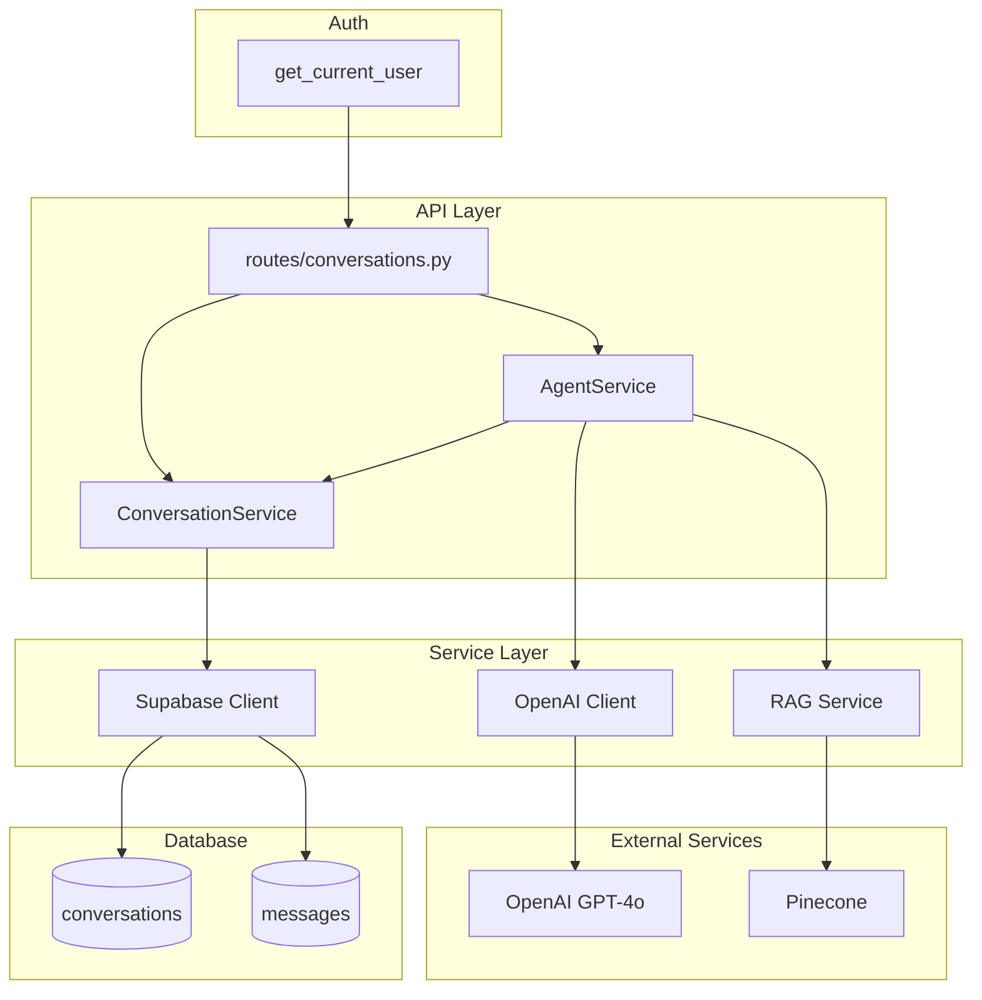

# Design Document: Conversations

## Overview

This design implements the conversation management system with OpenAI GPT-4o integration. It provides CRUD operations for conversations, message storage, agent response generation with context reconstruction, and phase tracking. The system supports both individual and company-associated conversations.

## Steering Document Alignment

### Technical Standards (tech.md)

- Uses OpenAI SDK (v1.0+) for GPT-4o integration
- Stores data in Supabase PostgreSQL
- Uses async/await for non-blocking API calls
- Follows layered architecture with service layer orchestration

### Project Structure (structure.md)

- OpenAI client in `src/core/openai.py`
- Services in `src/services/` for business logic
- Routes in `src/api/routes/` for HTTP endpoints
- Schemas in `src/schemas/` for API contracts

## Code Reuse Analysis

### Existing Components to Leverage

- **src/api/deps.py**: get_current_user for authentication
- **src/core/supabase.py**: Database operations
- **src/core/config.py**: OpenAI API key configuration
- **src/services/profile_service.py**: User profile lookup
- **src/services/company_service.py**: Company membership verification

### Integration Points

- **RAG Service**: Will query for relevant product context (from rag-integration spec)
- **Profile/Company**: Verifies user access to company conversations
- **Future**: WebSocket for real-time streaming (post-MVP)

## Architecture



## Components and Interfaces

### Component 1: OpenAI Client Singleton (`src/core/openai.py`)

- **Purpose:** Provide configured OpenAI client for agent interactions
- **Interfaces:**
  ```python
  def get_openai_client() -> OpenAI:
      """Returns configured OpenAI client singleton"""
  ```
- **Dependencies:** openai SDK, src/core/config.py
- **Reuses:** Settings for API key

### Component 2: Conversation Schemas (`src/schemas/conversation.py`)

- **Purpose:** Define conversation request/response contracts
- **Interfaces:**
  ```python
  class ConversationCreate(BaseModel):
      title: str | None = None
      company_id: UUID | None = None
      metadata: dict | None = None

  class ConversationResponse(BaseModel):
      id: UUID
      user_id: UUID
      company_id: UUID | None
      title: str
      phase: str
      metadata: dict | None
      message_count: int
      last_message_at: datetime | None
      created_at: datetime
      updated_at: datetime

  class ConversationListResponse(BaseModel):
      items: list[ConversationResponse]
      cursor: str | None
      has_more: bool
  ```
- **Dependencies:** pydantic
- **Reuses:** N/A

### Component 3: Message Schemas (`src/schemas/message.py`)

- **Purpose:** Define message request/response contracts
- **Interfaces:**
  ```python
  class MessageCreate(BaseModel):
      content: str
      metadata: dict | None = None

  class MessageResponse(BaseModel):
      id: UUID
      conversation_id: UUID
      role: str  # "user" or "assistant"
      content: str
      metadata: dict | None
      created_at: datetime

  class MessageWithAgentResponse(BaseModel):
      user_message: MessageResponse
      agent_message: MessageResponse
  ```
- **Dependencies:** pydantic
- **Reuses:** N/A

### Component 4: Conversation Service (`src/services/conversation_service.py`)

- **Purpose:** Business logic for conversation CRUD operations
- **Interfaces:**
  ```python
  class ConversationService:
      async def create_conversation(
          self, user_id: UUID, data: ConversationCreate
      ) -> dict

      async def get_conversation(self, conversation_id: UUID) -> dict | None

      async def list_conversations(
          self, user_id: UUID, cursor: str | None = None, limit: int = 20
      ) -> tuple[list[dict], str | None, bool]

      async def delete_conversation(self, conversation_id: UUID) -> bool

      async def update_phase(
          self, conversation_id: UUID, phase: str
      ) -> dict

      async def can_access(
          self, conversation_id: UUID, user_id: UUID
      ) -> bool
  ```
- **Dependencies:** src/core/supabase.py, src/services/company_service.py
- **Reuses:** CompanyService for membership checks

### Component 5: Agent Service (`src/services/agent_service.py`)

- **Purpose:** Orchestrate agent responses with context reconstruction
- **Interfaces:**
  ```python
  class AgentService:
      async def generate_response(
          self, conversation_id: UUID, user_message: str
      ) -> tuple[dict, dict]:
          """Returns (user_message_record, agent_message_record)"""

      async def build_context(
          self, conversation_id: UUID
      ) -> list[dict]:
          """Build OpenAI messages array from history"""

      def get_system_prompt(self, phase: str) -> str:
          """Get system prompt for conversation phase"""
  ```
- **Dependencies:** src/core/openai.py, src/services/conversation_service.py, src/services/rag_service.py (optional)
- **Reuses:** ConversationService for history, RAG service for product context

## Data Models

### Database Schema

```sql
-- conversations table
CREATE TABLE conversations (
    id UUID PRIMARY KEY DEFAULT gen_random_uuid(),
    user_id UUID NOT NULL REFERENCES profiles(id),
    company_id UUID REFERENCES companies(id),
    title TEXT NOT NULL,
    phase TEXT NOT NULL DEFAULT 'discovery',
    metadata JSONB DEFAULT '{}',
    created_at TIMESTAMPTZ DEFAULT NOW(),
    updated_at TIMESTAMPTZ DEFAULT NOW()
);

-- messages table
CREATE TABLE messages (
    id UUID PRIMARY KEY DEFAULT gen_random_uuid(),
    conversation_id UUID NOT NULL REFERENCES conversations(id) ON DELETE CASCADE,
    role TEXT NOT NULL,  -- 'user', 'assistant', 'system'
    content TEXT NOT NULL,
    metadata JSONB DEFAULT '{}',
    created_at TIMESTAMPTZ DEFAULT NOW()
);

-- indexes for performance
CREATE INDEX idx_conversations_user_id ON conversations(user_id);
CREATE INDEX idx_conversations_company_id ON conversations(company_id);
CREATE INDEX idx_conversations_updated_at ON conversations(updated_at DESC);
CREATE INDEX idx_messages_conversation_id ON messages(conversation_id);
CREATE INDEX idx_messages_created_at ON messages(created_at);
```

### Row-Level Security Policies

```sql
-- Conversations: users can access their own or company conversations
ALTER TABLE conversations ENABLE ROW LEVEL SECURITY;

CREATE POLICY conversations_select ON conversations FOR SELECT USING (
    user_id IN (SELECT id FROM profiles WHERE user_id = auth.uid())
    OR
    company_id IN (
        SELECT company_id FROM company_members
        WHERE profile_id IN (SELECT id FROM profiles WHERE user_id = auth.uid())
    )
);

-- Messages: access through conversation ownership
ALTER TABLE messages ENABLE ROW LEVEL SECURITY;

CREATE POLICY messages_select ON messages FOR SELECT USING (
    conversation_id IN (
        SELECT id FROM conversations WHERE
        user_id IN (SELECT id FROM profiles WHERE user_id = auth.uid())
        OR company_id IN (
            SELECT company_id FROM company_members
            WHERE profile_id IN (SELECT id FROM profiles WHERE user_id = auth.uid())
        )
    )
);
```

## System Prompt Design

```python
SYSTEM_PROMPTS = {
    "discovery": """You are an AI procurement assistant for Autopilot, helping enterprise buyers evaluate robotic cleaning solutions.

Current Phase: Discovery
Your goal is to understand the buyer's facility profile, priorities, and constraints.

Guidelines:
- Ask clarifying questions about facility type, size, and current cleaning approach
- Understand their priorities (cost reduction, quality improvement, labor challenges)
- Identify constraints (budget, timeline, integration requirements)
- Be helpful and educational, not pushy
- When you have enough information, suggest moving to the ROI phase

Keep responses conversational and focused. Ask one or two questions at a time.""",

    "roi": """You are an AI procurement assistant for Autopilot.

Current Phase: ROI Analysis
Your goal is to present ROI estimates and product recommendations.

Guidelines:
- Reference the facility profile from discovery
- Present estimated savings and payback periods
- Recommend specific products based on their needs
- Explain the assumptions behind calculations
- When ready, suggest moving to the selection phase""",

    "selection": """You are an AI procurement assistant for Autopilot.

Current Phase: Option Selection
Your goal is to help finalize their selection and define next steps.

Guidelines:
- Summarize the recommended options
- Help them identify stakeholders for the decision
- Define clear next steps
- Offer to connect them with sales for detailed proposals"""
}
```

## Error Handling

### Error Scenarios

1. **Conversation Not Found**
   - **Handling:** Return 404 Not Found
   - **User Impact:** `{"error": {"code": "NOT_FOUND", "message": "Conversation not found"}}`

2. **Access Denied**
   - **Handling:** Return 403 Forbidden
   - **User Impact:** `{"error": {"code": "FORBIDDEN", "message": "You don't have access to this conversation"}}`

3. **OpenAI API Error**
   - **Handling:** Log error, return 503 Service Unavailable
   - **User Impact:** `{"error": {"code": "AGENT_ERROR", "message": "Unable to generate response, please try again"}}`

4. **OpenAI Rate Limit**
   - **Handling:** Return 429 Too Many Requests with retry-after
   - **User Impact:** `{"error": {"code": "RATE_LIMITED", "message": "Too many requests, please wait"}}`

5. **Invalid Company Access**
   - **Handling:** Return 403 if user not in specified company
   - **User Impact:** `{"error": {"code": "FORBIDDEN", "message": "You're not a member of this company"}}`

## Testing Strategy

### Unit Testing

- Test ConversationService.create_conversation sets defaults
- Test ConversationService.can_access with owner and company member
- Test AgentService.build_context reconstructs history correctly
- Test AgentService.get_system_prompt returns phase-appropriate prompt

### Integration Testing

- Test POST /conversations creates conversation
- Test GET /conversations returns user's conversations
- Test POST /conversations/{id}/messages stores and returns messages
- Test agent response is generated and stored
- Test company conversation access

### End-to-End Testing

- Test complete conversation flow: create → send messages → receive responses
- Test phase progression through conversation

## File Manifest

| File | Purpose |
|------|---------|
| `src/core/openai.py` | OpenAI client singleton |
| `src/models/conversation.py` | Conversation model type hints |
| `src/models/message.py` | Message model type hints |
| `src/schemas/conversation.py` | Conversation Pydantic schemas |
| `src/schemas/message.py` | Message Pydantic schemas |
| `src/services/conversation_service.py` | Conversation business logic |
| `src/services/agent_service.py` | Agent response orchestration |
| `src/api/routes/conversations.py` | Conversation and message endpoints |
| `supabase/migrations/003_create_conversations.sql` | Conversations tables migration |
