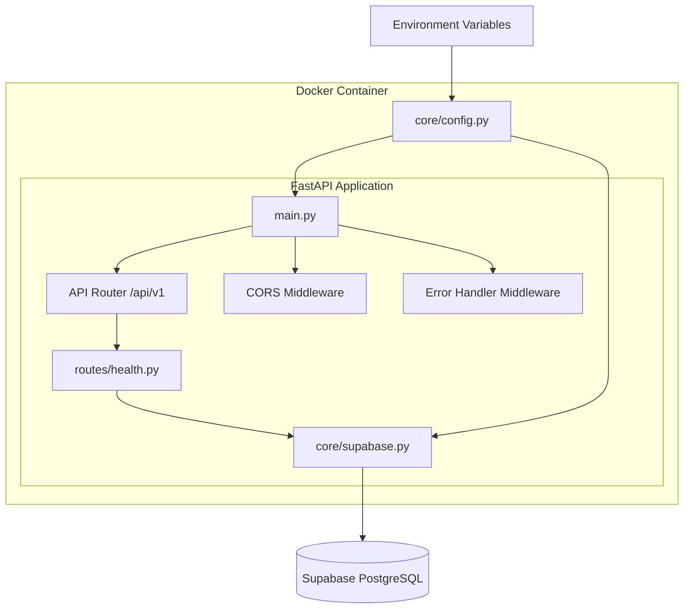

# Design Document: Core Infrastructure

## Overview

This design establishes the foundational infrastructure for the Autopilot backend API. It defines the FastAPI application structure, configuration management, Supabase client integration, health monitoring, error handling, and Docker containerization. All subsequent features will build upon this foundation.

## Steering Document Alignment

### Technical Standards (tech.md)
- Uses FastAPI with Pydantic v2 as specified
- Python 3.11+ runtime in Docker container
- Supabase Python SDK for database access
- uvicorn as ASGI server
- Environment-based configuration with python-dotenv

### Project Structure (structure.md)
- Follows the defined directory layout: `src/api/`, `src/core/`, etc.
- Uses snake_case for modules, PascalCase for classes
- Implements layered architecture with clear separation

## Code Reuse Analysis

### Existing Components to Leverage
- **None**: This is the foundational spec; no existing code to leverage

### Integration Points
- **Supabase**: External managed PostgreSQL service
- **Future specs**: Will import from `src/core/` and use middleware from `src/api/middleware/`

## Architecture



## Components and Interfaces

### Component 1: Configuration Manager (`src/core/config.py`)
- **Purpose:** Load and validate environment configuration
- **Interfaces:**
  ```python
  class Settings(BaseSettings):
      supabase_url: str
      supabase_anon_key: str
      supabase_service_role_key: str
      openai_api_key: str
      pinecone_api_key: str
      pinecone_environment: str
      pinecone_index_name: str
      environment: str = "development"
      debug: bool = False
      cors_origins: list[str] = ["*"]

  def get_settings() -> Settings:
      """Returns cached settings singleton"""
  ```
- **Dependencies:** pydantic-settings, python-dotenv
- **Reuses:** N/A (foundational)

### Component 2: Supabase Client Singleton (`src/core/supabase.py`)
- **Purpose:** Provide a single Supabase client instance for database operations
- **Interfaces:**
  ```python
  def get_supabase_client() -> Client:
      """Returns Supabase client singleton"""

  async def check_database_connection() -> bool:
      """Verify database connectivity, returns True if healthy"""
  ```
- **Dependencies:** supabase-py, core/config.py
- **Reuses:** N/A (foundational)

### Component 3: FastAPI Application (`src/main.py`)
- **Purpose:** Application entry point and middleware configuration
- **Interfaces:**
  ```python
  app = FastAPI(
      title="Autopilot API",
      description="Agent-led procurement platform API",
      version="1.0.0"
  )

  # Mounts /api/v1 router
  # Configures CORS, error handling
  ```
- **Dependencies:** FastAPI, core/config.py, api/routes/, api/middleware/
- **Reuses:** N/A (foundational)

### Component 4: Health Routes (`src/api/routes/health.py`)
- **Purpose:** Expose health check endpoints for monitoring
- **Interfaces:**
  ```python
  router = APIRouter(tags=["health"])

  @router.get("/health")
  async def health_check() -> HealthResponse:
      """Basic liveness check"""

  @router.get("/health/ready")
  async def readiness_check() -> ReadinessResponse:
      """Readiness check with dependency verification"""
  ```
- **Dependencies:** core/supabase.py
- **Reuses:** N/A (foundational)

### Component 5: Error Handler Middleware (`src/api/middleware/error_handler.py`)
- **Purpose:** Catch and format all unhandled exceptions
- **Interfaces:**
  ```python
  async def error_handler_middleware(request: Request, call_next) -> Response:
      """Wraps request handling with error catching"""

  class APIError(Exception):
      """Base exception for API errors"""
      code: str
      message: str
      status_code: int
  ```
- **Dependencies:** FastAPI, logging
- **Reuses:** N/A (foundational)

## Data Models

### HealthResponse Schema
```python
class HealthResponse(BaseModel):
    status: Literal["healthy", "unhealthy"]
    timestamp: datetime
```

### ReadinessResponse Schema
```python
class ReadinessResponse(BaseModel):
    status: Literal["ready", "not_ready"]
    checks: dict[str, CheckResult]
    timestamp: datetime

class CheckResult(BaseModel):
    status: Literal["pass", "fail"]
    message: str | None = None
```

### ErrorResponse Schema
```python
class ErrorDetail(BaseModel):
    code: str
    message: str

class ErrorResponse(BaseModel):
    error: ErrorDetail
```

## Error Handling

### Error Scenarios
1. **Missing Environment Variable**
   - **Handling:** Raise `ValidationError` during Settings initialization
   - **User Impact:** Application fails to start with clear error message

2. **Supabase Connection Failure**
   - **Handling:** `check_database_connection()` returns False; readiness endpoint returns 503
   - **User Impact:** `/health/ready` returns `{"status": "not_ready", "checks": {"database": {"status": "fail"}}}`

3. **Unhandled Exception in Route**
   - **Handling:** Error middleware catches, logs, returns standardized error response
   - **User Impact:** Receives `{"error": {"code": "INTERNAL_ERROR", "message": "An unexpected error occurred"}}`

4. **Invalid Request**
   - **Handling:** FastAPI/Pydantic validation returns 422 with details
   - **User Impact:** Receives validation errors with field-level details

## Testing Strategy

### Unit Testing
- Test `Settings` validation with missing/invalid env vars
- Test `get_supabase_client()` returns singleton
- Test error handler formats exceptions correctly
- Test health response schemas

### Integration Testing
- Test `/health` returns 200
- Test `/health/ready` with mocked Supabase client
- Test CORS headers are set correctly
- Test error middleware catches and formats exceptions

### End-to-End Testing
- Build Docker container and verify it starts
- Verify health endpoints respond correctly
- Verify environment variable configuration works

## File Manifest

| File | Purpose |
|------|---------|
| `src/main.py` | FastAPI app entry point |
| `src/core/__init__.py` | Core package init |
| `src/core/config.py` | Settings and configuration |
| `src/core/supabase.py` | Supabase client singleton |
| `src/api/__init__.py` | API package init |
| `src/api/routes/__init__.py` | Routes package init |
| `src/api/routes/health.py` | Health check endpoints |
| `src/api/middleware/__init__.py` | Middleware package init |
| `src/api/middleware/error_handler.py` | Error handling middleware |
| `src/schemas/__init__.py` | Schemas package init |
| `src/schemas/common.py` | Common schemas (health, error) |
| `Dockerfile` | Production container |
| `docker-compose.yml` | Local development |
| `pyproject.toml` | Project metadata and deps |
| `requirements.txt` | Pinned dependencies |
| `.env.example` | Environment template |
| `.gitignore` | Git ignore rules |
