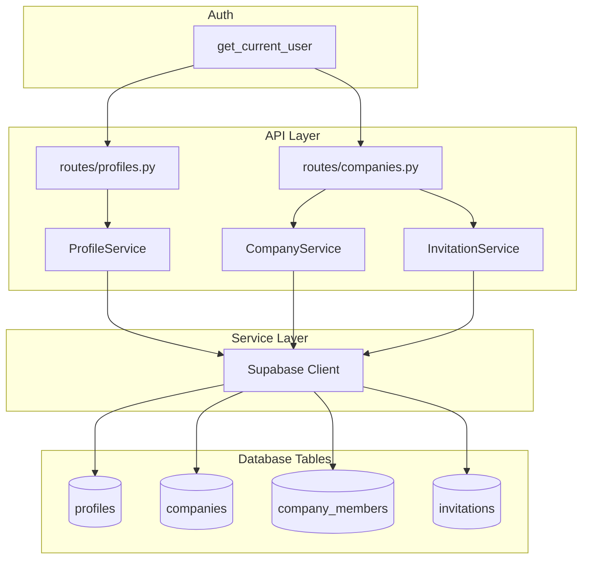

# Design Document: Profiles & Companies

## Overview

This design implements user profile management and company accounts with an invitation-based membership system. It supports individual users and teams with a simple Owner + Members permission model. All data is stored in Supabase PostgreSQL with Row-Level Security policies enforcing access control.

## Steering Document Alignment

### Technical Standards (tech.md)

- Uses Supabase PostgreSQL with RLS for data isolation
- Follows FastAPI patterns with Pydantic v2 schemas
- Uses async/await for database operations
- Implements layered architecture (routes → services → models)

### Project Structure (structure.md)

- Models in `src/models/` for database representations
- Schemas in `src/schemas/` for API contracts
- Services in `src/services/` for business logic
- Routes in `src/api/routes/` for HTTP endpoints

## Code Reuse Analysis

### Existing Components to Leverage

- **src/api/deps.py**: get_current_user dependency for authentication
- **src/core/supabase.py**: Supabase client for database operations
- **src/schemas/common.py**: ErrorResponse schema for errors
- **src/api/middleware/error_handler.py**: Exception handling

### Integration Points

- **Auth Layer**: Uses UserContext from auth for user identification
- **Conversations**: Conversations can be associated with company_id
- **Future Features**: Company context for team-based features

## Architecture



## Components and Interfaces

### Component 1: Profile Schemas (`src/schemas/profile.py`)

- **Purpose:** Define profile request/response contracts
- **Interfaces:**
  ```python
  class ProfileBase(BaseModel):
      display_name: str | None = None
      avatar_url: str | None = None

  class ProfileUpdate(ProfileBase):
      pass

  class ProfileResponse(ProfileBase):
      id: UUID
      user_id: UUID
      email: str
      created_at: datetime
  ```
- **Dependencies:** pydantic
- **Reuses:** N/A

### Component 2: Company Schemas (`src/schemas/company.py`)

- **Purpose:** Define company and invitation request/response contracts
- **Interfaces:**
  ```python
  class CompanyCreate(BaseModel):
      name: str

  class CompanyResponse(BaseModel):
      id: UUID
      name: str
      owner_id: UUID
      created_at: datetime
      member_count: int | None = None

  class CompanyMemberResponse(BaseModel):
      id: UUID
      profile: ProfileResponse
      role: str  # "owner" or "member"
      joined_at: datetime

  class InvitationCreate(BaseModel):
      email: EmailStr

  class InvitationResponse(BaseModel):
      id: UUID
      company_id: UUID
      email: str
      status: str  # "pending", "accepted", "expired"
      invited_by: UUID
      created_at: datetime
      expires_at: datetime
  ```
- **Dependencies:** pydantic, src/schemas/profile.py
- **Reuses:** ProfileResponse

### Component 3: Profile Service (`src/services/profile_service.py`)

- **Purpose:** Business logic for profile operations
- **Interfaces:**
  ```python
  class ProfileService:
      async def get_or_create_profile(self, user_id: UUID, email: str) -> dict
      async def get_profile(self, user_id: UUID) -> dict | None
      async def get_profile_by_id(self, profile_id: UUID) -> dict | None
      async def update_profile(self, user_id: UUID, data: ProfileUpdate) -> dict
      async def get_user_companies(self, user_id: UUID) -> list[dict]
  ```
- **Dependencies:** src/core/supabase.py
- **Reuses:** Supabase client

### Component 3a: Session Claim Integration (NEW)

Profile service integrates with session claiming via the DiscoveryProfileService:

```python
# When session is claimed, the following happens:
# 1. ProfileService.get_or_create_profile() ensures profile exists
# 2. DiscoveryProfileService.create_from_session() copies session data
# 3. ConversationService.transfer_to_profile() moves conversation ownership
# 4. CheckoutService.transfer_orders_to_profile() moves order ownership
# 5. SessionService marks session as claimed
```

This orchestration is handled by SessionService.claim_session() which coordinates all services.

### Component 4: Company Service (`src/services/company_service.py`)

- **Purpose:** Business logic for company and member operations
- **Interfaces:**
  ```python
  class CompanyService:
      async def create_company(self, name: str, owner_id: UUID) -> dict
      async def get_company(self, company_id: UUID) -> dict | None
      async def get_members(self, company_id: UUID) -> list[dict]
      async def remove_member(self, company_id: UUID, profile_id: UUID) -> bool
      async def is_member(self, company_id: UUID, user_id: UUID) -> bool
      async def is_owner(self, company_id: UUID, user_id: UUID) -> bool
  ```
- **Dependencies:** src/core/supabase.py
- **Reuses:** Supabase client

### Component 5: Invitation Service (`src/services/invitation_service.py`)

- **Purpose:** Business logic for invitation operations
- **Interfaces:**
  ```python
  class InvitationService:
      async def create_invitation(self, company_id: UUID, email: str, invited_by: UUID) -> dict
      async def get_invitation(self, invitation_id: UUID) -> dict | None
      async def accept_invitation(self, invitation_id: UUID, user_id: UUID) -> dict
      async def list_company_invitations(self, company_id: UUID) -> list[dict]
      async def get_pending_invitations_for_email(self, email: str) -> list[dict]
  ```
- **Dependencies:** src/core/supabase.py, src/services/company_service.py
- **Reuses:** Supabase client, CompanyService for member creation

## Data Models

### Database Schema

```sql
-- profiles table
CREATE TABLE profiles (
    id UUID PRIMARY KEY DEFAULT gen_random_uuid(),
    user_id UUID UNIQUE NOT NULL REFERENCES auth.users(id),
    display_name TEXT,
    email TEXT NOT NULL,
    avatar_url TEXT,
    created_at TIMESTAMPTZ DEFAULT NOW(),
    updated_at TIMESTAMPTZ DEFAULT NOW()
);

-- companies table
CREATE TABLE companies (
    id UUID PRIMARY KEY DEFAULT gen_random_uuid(),
    name TEXT NOT NULL,
    owner_id UUID NOT NULL REFERENCES profiles(id),
    created_at TIMESTAMPTZ DEFAULT NOW(),
    updated_at TIMESTAMPTZ DEFAULT NOW()
);

-- company_members table
CREATE TABLE company_members (
    id UUID PRIMARY KEY DEFAULT gen_random_uuid(),
    company_id UUID NOT NULL REFERENCES companies(id) ON DELETE CASCADE,
    profile_id UUID NOT NULL REFERENCES profiles(id) ON DELETE CASCADE,
    role TEXT NOT NULL DEFAULT 'member',
    joined_at TIMESTAMPTZ DEFAULT NOW(),
    UNIQUE(company_id, profile_id)
);

-- invitations table
CREATE TABLE invitations (
    id UUID PRIMARY KEY DEFAULT gen_random_uuid(),
    company_id UUID NOT NULL REFERENCES companies(id) ON DELETE CASCADE,
    email TEXT NOT NULL,
    invited_by UUID NOT NULL REFERENCES profiles(id),
    status TEXT NOT NULL DEFAULT 'pending',
    created_at TIMESTAMPTZ DEFAULT NOW(),
    expires_at TIMESTAMPTZ DEFAULT NOW() + INTERVAL '7 days'
);
```

### Row-Level Security Policies

```sql
-- Profiles: users can only read/write their own profile
ALTER TABLE profiles ENABLE ROW LEVEL SECURITY;
CREATE POLICY profiles_select ON profiles FOR SELECT USING (auth.uid() = user_id);
CREATE POLICY profiles_update ON profiles FOR UPDATE USING (auth.uid() = user_id);

-- Companies: members can read their companies
ALTER TABLE companies ENABLE ROW LEVEL SECURITY;
CREATE POLICY companies_select ON companies FOR SELECT USING (
    id IN (SELECT company_id FROM company_members WHERE profile_id IN (
        SELECT id FROM profiles WHERE user_id = auth.uid()
    ))
);

-- Company members: members can read other members of their companies
ALTER TABLE company_members ENABLE ROW LEVEL SECURITY;
CREATE POLICY members_select ON company_members FOR SELECT USING (
    company_id IN (SELECT company_id FROM company_members WHERE profile_id IN (
        SELECT id FROM profiles WHERE user_id = auth.uid()
    ))
);

-- Invitations: company members can read, owners can write
ALTER TABLE invitations ENABLE ROW LEVEL SECURITY;
CREATE POLICY invitations_select ON invitations FOR SELECT USING (
    company_id IN (SELECT company_id FROM company_members WHERE profile_id IN (
        SELECT id FROM profiles WHERE user_id = auth.uid()
    ))
);
```

## Error Handling

### Error Scenarios

1. **Profile Not Found**
   - **Handling:** Auto-create profile on first access
   - **User Impact:** Transparent to user

2. **Company Not Found**
   - **Handling:** Return 404 Not Found
   - **User Impact:** `{"error": {"code": "NOT_FOUND", "message": "Company not found"}}`

3. **Not a Company Member**
   - **Handling:** Return 403 Forbidden
   - **User Impact:** `{"error": {"code": "FORBIDDEN", "message": "Not a member of this company"}}`

4. **Not Company Owner (for owner-only actions)**
   - **Handling:** Return 403 Forbidden
   - **User Impact:** `{"error": {"code": "FORBIDDEN", "message": "Only company owner can perform this action"}}`

5. **Invitation Expired**
   - **Handling:** Return 400 Bad Request
   - **User Impact:** `{"error": {"code": "INVITATION_EXPIRED", "message": "This invitation has expired"}}`

6. **Already a Member**
   - **Handling:** Return 400 Bad Request
   - **User Impact:** `{"error": {"code": "ALREADY_MEMBER", "message": "User is already a member of this company"}}`

## Testing Strategy

### Unit Testing

- Test ProfileService.get_or_create_profile creates new profile
- Test ProfileService.get_or_create_profile returns existing profile
- Test CompanyService.create_company sets owner correctly
- Test CompanyService.is_member returns correct boolean
- Test InvitationService.accept_invitation adds member

### Integration Testing

- Test GET /profiles/me returns authenticated user's profile
- Test PUT /profiles/me updates profile
- Test POST /companies creates company with owner
- Test GET /companies/{id}/members returns members
- Test POST /companies/{id}/invitations creates invitation
- Test POST /invitations/{id}/accept adds member

### End-to-End Testing

- Test complete flow: create company → invite → accept → verify membership
- Test permission enforcement across all endpoints

## File Manifest

| File | Purpose |
|------|---------|
| `src/models/profile.py` | Profile model type hints |
| `src/models/company.py` | Company, CompanyMember, Invitation model type hints |
| `src/schemas/profile.py` | Profile Pydantic schemas |
| `src/schemas/company.py` | Company and invitation Pydantic schemas |
| `src/services/profile_service.py` | Profile business logic |
| `src/services/company_service.py` | Company business logic |
| `src/services/invitation_service.py` | Invitation business logic |
| `src/api/routes/profiles.py` | Profile endpoints |
| `src/api/routes/companies.py` | Company and invitation endpoints |
| `supabase/migrations/001_create_profiles.sql` | Profiles table migration |
| `supabase/migrations/002_create_companies.sql` | Companies and related tables migration |
