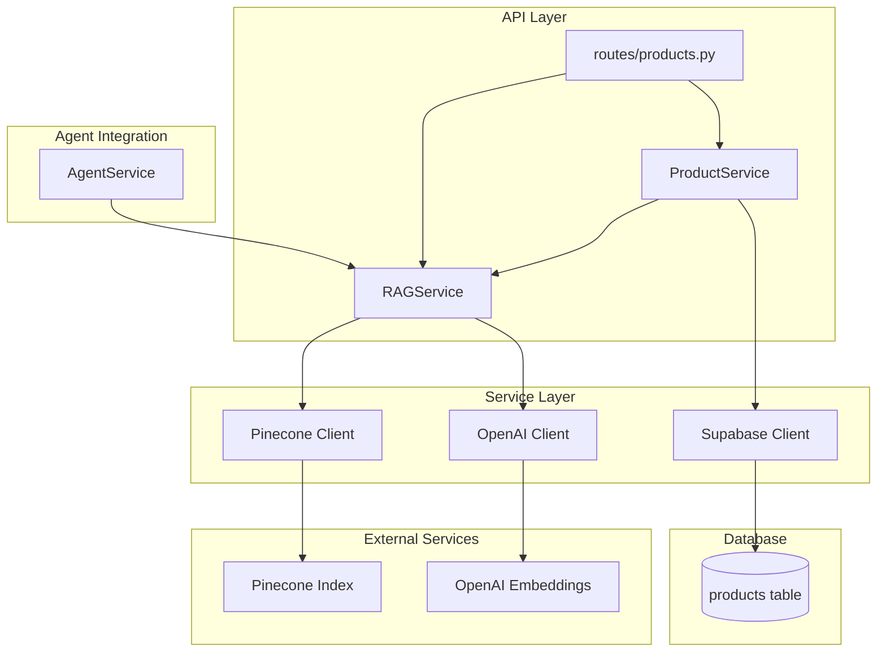

# Design Document: RAG Integration

## Overview

This design implements Retrieval-Augmented Generation using Pinecone as the vector database and OpenAI for embedding generation. It enables semantic search over the product catalog and provides relevant product context for agent conversations. The system supports product indexing, search, and context injection into the agent prompt.

## Steering Document Alignment

### Technical Standards (tech.md)

- Uses Pinecone Python client (v3.0+) for vector operations
- Uses OpenAI text-embedding-3-small for embeddings
- Follows async/await patterns for non-blocking operations
- Stores product metadata in both Supabase and Pinecone

### Project Structure (structure.md)

- Pinecone client in `src/core/pinecone.py`
- RAG service in `src/services/rag_service.py`
- Product routes in `src/api/routes/products.py`
- Indexing script in `scripts/index_products.py`

## Code Reuse Analysis

### Existing Components to Leverage

- **src/core/config.py**: Pinecone API key and configuration
- **src/core/openai.py**: OpenAI client for embedding generation
- **src/core/supabase.py**: Product data storage
- **src/services/agent_service.py**: Integration point for context injection

### Integration Points

- **Agent Service**: RAG service provides product context for agent prompts
- **OpenAI**: Shared client for both chat completions and embeddings
- **Supabase**: Product data storage with embedding_id reference

## Architecture



## Components and Interfaces

### Component 1: Pinecone Client Singleton (`src/core/pinecone.py`)

- **Purpose:** Provide configured Pinecone client for vector operations
- **Interfaces:**
  ```python
  def get_pinecone_client() -> Pinecone:
      """Returns configured Pinecone client singleton"""

  def get_pinecone_index() -> Index:
      """Returns the configured Pinecone index"""

  async def check_pinecone_connection() -> bool:
      """Verify Pinecone connectivity"""
  ```
- **Dependencies:** pinecone-client, src/core/config.py
- **Reuses:** Settings for API key and index name

### Component 2: Product Schemas (`src/schemas/product.py`)

- **Purpose:** Define product request/response contracts
- **Interfaces:**
  ```python
  class ProductBase(BaseModel):
      name: str
      description: str
      category: str
      specs: dict
      pricing: dict | None = None

  class ProductCreate(ProductBase):
      pass

  class ProductResponse(ProductBase):
      id: UUID
      embedding_id: str | None
      created_at: datetime

  class ProductSearchRequest(BaseModel):
      query: str
      category: str | None = None
      top_k: int = 5

  class ProductSearchResult(BaseModel):
      product: ProductResponse
      score: float
  ```
- **Dependencies:** pydantic
- **Reuses:** N/A

### Component 3: RAG Service (`src/services/rag_service.py`)

- **Purpose:** Handle embedding generation, indexing, and semantic search
- **Interfaces:**
  ```python
  class RAGService:
      async def generate_embedding(self, text: str) -> list[float]:
          """Generate embedding vector for text"""

      async def index_product(self, product: dict) -> str:
          """Index product in Pinecone, returns embedding_id"""

      async def index_products_batch(
          self, products: list[dict]
      ) -> list[str]:
          """Batch index multiple products"""

      async def search_products(
          self, query: str, category: str | None = None, top_k: int = 5
      ) -> list[tuple[str, float]]:
          """Search for products, returns (product_id, score) tuples"""

      async def get_relevant_products(
          self, conversation_context: str, top_k: int = 3
      ) -> list[dict]:
          """Get relevant products for agent context"""

      async def delete_product_embedding(
          self, embedding_id: str
      ) -> bool:
          """Remove product from Pinecone index"""
  ```
- **Dependencies:** src/core/pinecone.py, src/core/openai.py
- **Reuses:** OpenAI client, Pinecone client

### Component 4: Product Service (`src/services/product_service.py`)

- **Purpose:** Business logic for product CRUD operations
- **Interfaces:**
  ```python
  class ProductService:
      async def create_product(self, data: ProductCreate) -> dict
      async def get_product(self, product_id: UUID) -> dict | None
      async def list_products(
          self, cursor: str | None = None, limit: int = 20
      ) -> tuple[list[dict], str | None, bool]
      async def search_products(
          self, query: str, category: str | None = None, top_k: int = 5
      ) -> list[dict]
  ```
- **Dependencies:** src/core/supabase.py, src/services/rag_service.py
- **Reuses:** RAGService for search

## Data Models

### Database Schema

```sql
-- products table
CREATE TABLE products (
    id UUID PRIMARY KEY DEFAULT gen_random_uuid(),
    name TEXT NOT NULL,
    description TEXT NOT NULL,
    category TEXT NOT NULL,
    specs JSONB NOT NULL DEFAULT '{}',
    pricing JSONB,
    embedding_id TEXT,  -- Reference to Pinecone vector
    created_at TIMESTAMPTZ DEFAULT NOW(),
    updated_at TIMESTAMPTZ DEFAULT NOW()
);

-- indexes
CREATE INDEX idx_products_category ON products(category);
CREATE INDEX idx_products_embedding_id ON products(embedding_id);
```

### Pinecone Vector Schema

```python
# Vector metadata stored in Pinecone
{
    "id": "product_uuid",  # Same as Supabase product.id
    "values": [0.1, 0.2, ...],  # 1536-dim embedding
    "metadata": {
        "product_id": "uuid",
        "name": "Product Name",
        "category": "cleaning_robots",
        "description_preview": "First 200 chars..."
    }
}
```

### Embedding Text Format

```python
def build_embedding_text(product: dict) -> str:
    """Build text for embedding generation"""
    specs_text = " ".join(f"{k}: {v}" for k, v in product["specs"].items())
    return f"{product['name']}. {product['description']}. {specs_text}"
```

## Agent Context Injection

When the agent generates a response, RAG provides relevant product context:

```python
# In AgentService.build_context()
async def build_context(self, conversation_id: UUID) -> list[dict]:
    # Get conversation history
    messages = await self.conversation_service.get_recent_messages(
        conversation_id, limit=self.settings.max_context_messages
    )

    # Extract context for RAG query
    recent_content = " ".join(m["content"] for m in messages[-3:])

    # Get relevant products
    products = await self.rag_service.get_relevant_products(
        recent_content, top_k=3
    )

    # Build system prompt with product context
    product_context = self._format_products_for_prompt(products)
    system_prompt = self.get_system_prompt(phase) + f"\n\nRelevant Products:\n{product_context}"

    return [
        {"role": "system", "content": system_prompt},
        *[{"role": m["role"], "content": m["content"]} for m in messages]
    ]

def _format_products_for_prompt(self, products: list[dict]) -> str:
    """Format products for inclusion in system prompt"""
    if not products:
        return "No specific products identified yet."

    lines = []
    for p in products:
        lines.append(f"- {p['name']} ({p['category']}): {p['description'][:200]}")
        if p.get("pricing"):
            lines.append(f"  Pricing: {p['pricing']}")
    return "\n".join(lines)
```

## Error Handling

### Error Scenarios

1. **Pinecone Connection Failure**
   - **Handling:** Log error, return gracefully degraded response
   - **User Impact:** Agent proceeds without product context

2. **Embedding Generation Failure**
   - **Handling:** Log error, retry with backoff, skip if persistent
   - **User Impact:** Product not indexed until retry succeeds

3. **Search Timeout**
   - **Handling:** Return empty results with warning
   - **User Impact:** Agent proceeds without product context

4. **Invalid Product Data**
   - **Handling:** Return 400 Bad Request with validation errors
   - **User Impact:** `{"error": {"code": "VALIDATION_ERROR", "message": "Invalid product data"}}`

## Testing Strategy

### Unit Testing

- Test RAGService.generate_embedding returns vector
- Test RAGService.build_embedding_text formats correctly
- Test RAGService.search_products with mocked Pinecone
- Test ProductService integration with RAGService

### Integration Testing

- Test POST /products creates product and indexes
- Test POST /products/search returns relevant results
- Test agent context includes product information
- Test graceful degradation when Pinecone unavailable

### End-to-End Testing

- Test complete flow: create product → index → search → find
- Test agent conversation with product recommendations

## File Manifest

| File | Purpose |
|------|---------|
| `src/core/pinecone.py` | Pinecone client singleton |
| `src/models/product.py` | Product model type hints |
| `src/schemas/product.py` | Product Pydantic schemas |
| `src/services/product_service.py` | Product business logic |
| `src/services/rag_service.py` | RAG operations (embed, index, search) |
| `src/api/routes/products.py` | Product API endpoints |
| `scripts/index_products.py` | Batch indexing script |
| `supabase/migrations/004_create_products.sql` | Products table migration |
