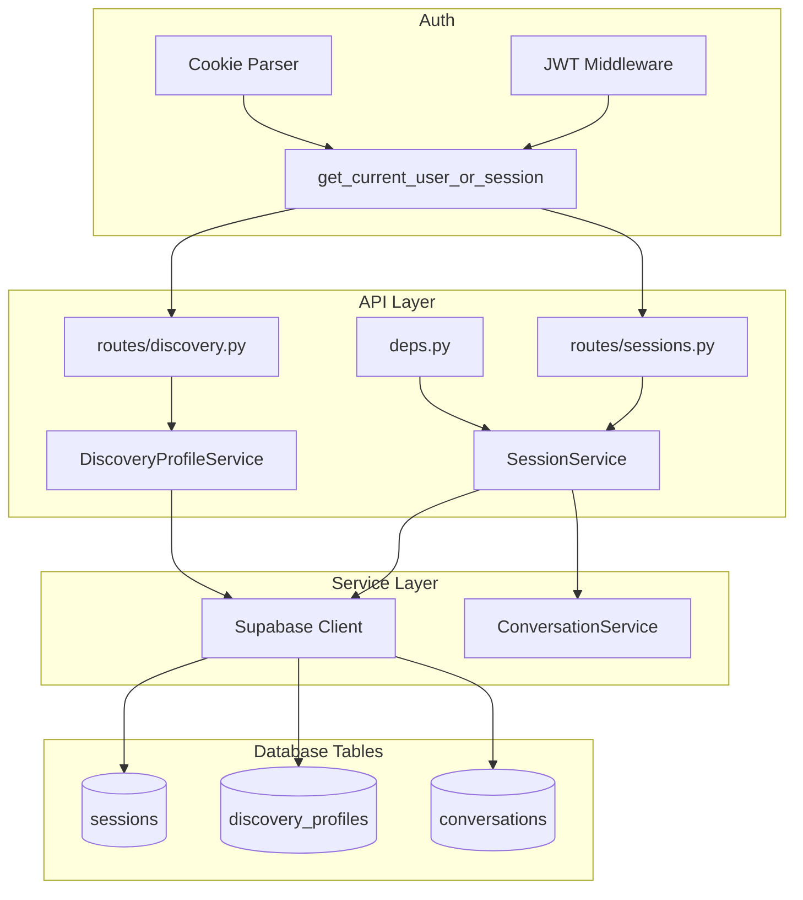
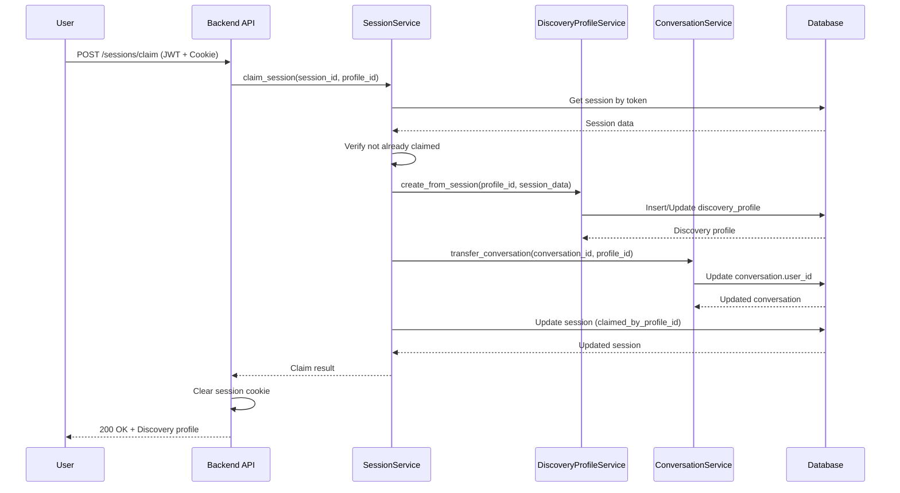

# Design Document: Sessions & Discovery Profiles

## Overview

This design implements session management for anonymous users and discovery profile storage for authenticated users. It enables users to interact with the Autopilot agent before signing up, with their data automatically transferred when they authenticate. The design aligns frontend `DiscoverySession` data structures with backend storage.

## Steering Document Alignment

### Technical Standards (tech.md)

- Uses Supabase PostgreSQL with RLS for data isolation
- Follows FastAPI patterns with Pydantic v2 schemas
- Uses async/await for database operations
- Implements layered architecture (routes -> services -> models)

### Project Structure (structure.md)

- Models in `src/models/` for database representations
- Schemas in `src/schemas/` for API contracts
- Services in `src/services/` for business logic
- Routes in `src/api/routes/` for HTTP endpoints

## Code Reuse Analysis

### Existing Components to Leverage

- **src/api/deps.py**: Extend with session-aware dependency
- **src/core/supabase.py**: Supabase client for database operations
- **src/schemas/common.py**: ErrorResponse schema for errors
- **src/api/middleware/error_handler.py**: Exception handling
- **src/services/conversation_service.py**: Extend for session ownership

### Integration Points

- **Auth Layer**: Dual-mode authentication (JWT or session cookie)
- **Conversations**: Session-owned conversations with ownership transfer
- **Profiles**: Discovery profile linked to user profile
- **Checkout**: Session tracking through purchase flow

## Architecture



## Components and Interfaces

### Component 1: Session Schemas (`src/schemas/session.py`)

- **Purpose:** Define session request/response contracts aligned with frontend types
- **Interfaces:**
  ```python
  class DiscoveryAnswerSchema(BaseModel):
      questionId: int
      key: str
      label: str
      value: str
      group: Literal['Company', 'Facility', 'Operations', 'Economics', 'Context']

  class ROIInputsSchema(BaseModel):
      laborRate: float
      utilization: float
      maintenanceFactor: float
      manualMonthlySpend: float
      manualMonthlyHours: float

  class SessionUpdate(BaseModel):
      current_question_index: int | None = None
      phase: Literal['discovery', 'roi', 'greenlight'] | None = None
      answers: dict[str, DiscoveryAnswerSchema] | None = None
      roi_inputs: ROIInputsSchema | None = None
      selected_product_ids: list[UUID] | None = None
      timeframe: Literal['monthly', 'yearly'] | None = None

  class SessionResponse(BaseModel):
      id: UUID
      current_question_index: int
      phase: str
      answers: dict[str, DiscoveryAnswerSchema]
      roi_inputs: ROIInputsSchema | None
      selected_product_ids: list[UUID]
      timeframe: str | None
      conversation_id: UUID | None
      expires_at: datetime
      created_at: datetime
  ```
- **Dependencies:** pydantic
- **Reuses:** N/A

### Component 2: Discovery Profile Schemas (`src/schemas/discovery.py`)

- **Purpose:** Define discovery profile request/response contracts
- **Interfaces:**
  ```python
  class DiscoveryProfileUpdate(BaseModel):
      current_question_index: int | None = None
      phase: Literal['discovery', 'roi', 'greenlight'] | None = None
      answers: dict[str, DiscoveryAnswerSchema] | None = None
      roi_inputs: ROIInputsSchema | None = None
      selected_product_ids: list[UUID] | None = None
      timeframe: Literal['monthly', 'yearly'] | None = None

  class DiscoveryProfileResponse(BaseModel):
      id: UUID
      profile_id: UUID
      current_question_index: int
      phase: str
      answers: dict[str, DiscoveryAnswerSchema]
      roi_inputs: ROIInputsSchema | None
      selected_product_ids: list[UUID]
      timeframe: str | None
      created_at: datetime
      updated_at: datetime
  ```
- **Dependencies:** pydantic, src/schemas/session.py
- **Reuses:** DiscoveryAnswerSchema, ROIInputsSchema from session schemas

### Component 3: Session Service (`src/services/session_service.py`)

- **Purpose:** Business logic for session operations
- **Interfaces:**
  ```python
  class SessionService:
      async def create_session(self) -> tuple[dict, str]:
          """Create new session, return (session_data, token)"""

      async def get_session_by_token(self, token: str) -> dict | None:
          """Get session by cookie token"""

      async def update_session(self, session_id: UUID, data: SessionUpdate) -> dict:
          """Update session data"""

      async def claim_session(
          self, session_id: UUID, profile_id: UUID, user_id: UUID
      ) -> dict:
          """Merge session to profile, transfer conversation"""

      async def is_session_valid(self, token: str) -> bool:
          """Check if session token is valid and not expired"""

      async def cleanup_expired_sessions(self) -> int:
          """Delete expired sessions, return count deleted"""
  ```
- **Dependencies:** src/core/supabase.py, secrets module
- **Reuses:** Supabase client

### Component 4: Discovery Profile Service (`src/services/discovery_profile_service.py`)

- **Purpose:** Business logic for authenticated user discovery profiles
- **Interfaces:**
  ```python
  class DiscoveryProfileService:
      async def get_or_create(self, profile_id: UUID) -> dict:
          """Get or create discovery profile for user"""

      async def update(
          self, profile_id: UUID, data: DiscoveryProfileUpdate
      ) -> dict:
          """Update discovery profile"""

      async def create_from_session(
          self, profile_id: UUID, session_data: dict
      ) -> dict:
          """Create discovery profile from session data"""
  ```
- **Dependencies:** src/core/supabase.py
- **Reuses:** Supabase client

### Component 5: Profile Extraction Service (`src/services/profile_extraction_service.py`)

- **Purpose:** AI-powered extraction of discovery data from conversations
- **Interfaces:**
  ```python
  class ProfileExtractionService:
      EXTRACTION_MODEL = "gpt-4o-mini"
      MAX_MESSAGES_FOR_EXTRACTION = 10

      async def extract_and_update(
          self,
          conversation_id: UUID,
          session_id: UUID | None = None,
          profile_id: UUID | None = None,
      ) -> dict[str, Any]:
          """Extract discovery data and update session/profile.

          Returns:
              {
                  "extracted_count": int,
                  "confidence": "high" | "medium" | "low",
                  "keys_extracted": ["sqft", "courts_count", ...]
              }
          """

      def _validate_and_enrich_answers(
          self,
          answers: dict[str, Any],
      ) -> dict[str, Any]:
          """Validate keys against QUESTION_BY_KEY and enrich with metadata."""

      async def _update_target(
          self,
          session_id: UUID | None,
          profile_id: UUID | None,
          answers: dict[str, Any],
          roi_inputs: dict[str, Any] | None,
      ) -> None:
          """Update session or discovery profile with extracted data."""
  ```
- **Dependencies:** openai, src/services/conversation_service.py, src/services/session_service.py, src/services/discovery_profile_service.py
- **Reuses:** SessionService, DiscoveryProfileService, ConversationService

### Component 6: Extraction Constants (`src/services/extraction_constants.py`)

- **Purpose:** Define discovery questions and extraction prompts aligned with frontend
- **Interfaces:**
  ```python
  # 25 discovery questions with id, key, label, group
  DISCOVERY_QUESTIONS: list[dict]

  # Lookup by key for validation
  QUESTION_BY_KEY: dict[str, dict]

  # Valid question keys set
  VALID_QUESTION_KEYS: set[str]

  # OpenAI prompts for extraction
  EXTRACTION_SYSTEM_PROMPT: str
  EXTRACTION_USER_PROMPT: str

  # JSON Schema for structured output
  EXTRACTION_SCHEMA: dict
  ```
- **Dependencies:** None
- **Reuses:** N/A

### Component 7: Dual Auth Dependency (`src/api/deps.py`)

- **Purpose:** Provide reusable dependency for dual authentication
- **Interfaces:**
  ```python
  class AuthContext(BaseModel):
      """Union type for authenticated user or session"""
      user: UserContext | None = None
      session: SessionContext | None = None

      @property
      def is_authenticated(self) -> bool:
          return self.user is not None

  class SessionContext(BaseModel):
      session_id: UUID
      session_token: str

  async def get_current_user_or_session(
      request: Request,
      authorization: str | None = Header(None),
  ) -> AuthContext:
      """Get user from JWT or session from cookie"""
  ```
- **Dependencies:** src/api/middleware/auth.py, src/services/session_service.py
- **Reuses:** Existing JWT validation

## Data Models

### Database Schema

```sql
-- Session phase enum (shared with discovery_profiles)
CREATE TYPE session_phase AS ENUM ('discovery', 'roi', 'greenlight');

-- Sessions table for anonymous users
CREATE TABLE sessions (
    id UUID PRIMARY KEY DEFAULT gen_random_uuid(),
    session_token VARCHAR(64) NOT NULL UNIQUE,
    conversation_id UUID REFERENCES conversations(id) ON DELETE SET NULL,
    current_question_index INTEGER NOT NULL DEFAULT 0,
    phase session_phase NOT NULL DEFAULT 'discovery',
    answers JSONB NOT NULL DEFAULT '{}',
    roi_inputs JSONB DEFAULT NULL,
    selected_product_ids UUID[] DEFAULT '{}',
    timeframe VARCHAR(50),
    metadata JSONB DEFAULT '{}',
    claimed_by_profile_id UUID REFERENCES profiles(id) ON DELETE SET NULL,
    expires_at TIMESTAMPTZ NOT NULL DEFAULT NOW() + INTERVAL '30 days',
    created_at TIMESTAMPTZ NOT NULL DEFAULT NOW(),
    updated_at TIMESTAMPTZ NOT NULL DEFAULT NOW()
);

-- Indexes
CREATE INDEX idx_sessions_token ON sessions(session_token);
CREATE INDEX idx_sessions_conversation_id ON sessions(conversation_id);
CREATE INDEX idx_sessions_expires_at ON sessions(expires_at);
CREATE INDEX idx_sessions_claimed ON sessions(claimed_by_profile_id) WHERE claimed_by_profile_id IS NOT NULL;

-- Discovery profiles table for authenticated users
CREATE TABLE discovery_profiles (
    id UUID PRIMARY KEY DEFAULT gen_random_uuid(),
    profile_id UUID NOT NULL UNIQUE REFERENCES profiles(id) ON DELETE CASCADE,
    current_question_index INTEGER NOT NULL DEFAULT 0,
    phase session_phase NOT NULL DEFAULT 'discovery',
    answers JSONB NOT NULL DEFAULT '{}',
    roi_inputs JSONB DEFAULT NULL,
    selected_product_ids UUID[] DEFAULT '{}',
    timeframe VARCHAR(50),
    created_at TIMESTAMPTZ NOT NULL DEFAULT NOW(),
    updated_at TIMESTAMPTZ NOT NULL DEFAULT NOW()
);

-- Indexes
CREATE INDEX idx_discovery_profiles_profile_id ON discovery_profiles(profile_id);
```

### Conversations Table Modifications

```sql
-- Make user_id nullable for session-owned conversations
ALTER TABLE conversations
    ALTER COLUMN user_id DROP NOT NULL;

-- Add session_id foreign key
ALTER TABLE conversations
    ADD COLUMN session_id UUID REFERENCES sessions(id) ON DELETE SET NULL;

-- Ensure conversation has an owner
ALTER TABLE conversations
    ADD CONSTRAINT chk_conversation_owner
    CHECK (user_id IS NOT NULL OR session_id IS NOT NULL);

-- Index for session lookups
CREATE INDEX idx_conversations_session_id ON conversations(session_id);
```

### Phase Enum Migration

```sql
-- Update conversation_phase enum to align with frontend
-- Step 1: Create new type
CREATE TYPE conversation_phase_new AS ENUM ('discovery', 'roi', 'greenlight');

-- Step 2: Update existing values
UPDATE conversations SET phase = 'greenlight' WHERE phase = 'selection';
UPDATE conversations SET phase = 'greenlight' WHERE phase = 'completed';

-- Step 3: Alter column type
ALTER TABLE conversations
    ALTER COLUMN phase TYPE conversation_phase_new
    USING phase::text::conversation_phase_new;

-- Step 4: Drop old type and rename
DROP TYPE conversation_phase;
ALTER TYPE conversation_phase_new RENAME TO conversation_phase;
```

### Row-Level Security Policies

```sql
-- Sessions: no RLS needed, token-based access in service layer
-- (Service uses secret key, bypasses RLS)

-- Discovery profiles: users can only access their own
ALTER TABLE discovery_profiles ENABLE ROW LEVEL SECURITY;

CREATE POLICY discovery_profiles_select ON discovery_profiles
    FOR SELECT USING (
        profile_id IN (SELECT id FROM profiles WHERE user_id = auth.uid())
    );

CREATE POLICY discovery_profiles_insert ON discovery_profiles
    FOR INSERT WITH CHECK (
        profile_id IN (SELECT id FROM profiles WHERE user_id = auth.uid())
    );

CREATE POLICY discovery_profiles_update ON discovery_profiles
    FOR UPDATE USING (
        profile_id IN (SELECT id FROM profiles WHERE user_id = auth.uid())
    );
```

## Cookie Configuration

```python
SESSION_COOKIE_CONFIG = {
    "key": "autopilot_session",
    "max_age": 2592000,  # 30 days
    "httponly": True,
    "secure": True,  # False in development
    "samesite": "lax",
    "path": "/",
}
```

## Error Handling

### Error Scenarios

1. **Session Not Found**
   - **Handling:** Create new session and set cookie
   - **User Impact:** Transparent, new session returned

2. **Session Expired**
   - **Handling:** Delete old session, create new one
   - **User Impact:** Data lost, starts fresh

3. **Session Already Claimed**
   - **Handling:** Return 400 Bad Request
   - **User Impact:** `{"error": {"code": "SESSION_ALREADY_CLAIMED", "message": "This session has already been claimed"}}`

4. **Invalid Session Token**
   - **Handling:** Create new session
   - **User Impact:** Transparent, new session returned

5. **Discovery Profile Not Found**
   - **Handling:** Auto-create on first access
   - **User Impact:** Transparent, new profile returned

6. **Conversation Transfer Failed**
   - **Handling:** Rollback claim, return 500
   - **User Impact:** `{"error": {"code": "CLAIM_FAILED", "message": "Failed to transfer conversation"}}`

## Data Flow: Session Claim



## Testing Strategy

### Unit Testing

- Test SessionService.create_session generates unique token
- Test SessionService.get_session_by_token returns correct data
- Test SessionService.claim_session transfers all data
- Test DiscoveryProfileService.create_from_session copies fields correctly
- Test dual auth dependency prioritizes JWT over session

### Integration Testing

- Test POST /sessions creates session and sets cookie
- Test GET /sessions/me returns session data
- Test PUT /sessions/me updates session fields
- Test POST /sessions/claim merges data to profile
- Test GET /discovery returns user's discovery profile
- Test conversation access with session token

### End-to-End Testing

- Test complete flow: create session -> chat -> answer questions -> signup -> claim
- Test session expiration handling
- Test conversation ownership transfer

## File Manifest

| File | Purpose |
|------|---------|
| `supabase/migrations/005_create_sessions.sql` | Sessions table and enum |
| `supabase/migrations/006_create_discovery_profiles.sql` | Discovery profiles table |
| `supabase/migrations/009_update_conversations.sql` | Add session_id, update phase enum |
| `src/models/session.py` | Session TypedDict |
| `src/models/discovery_profile.py` | DiscoveryProfile TypedDict |
| `src/schemas/session.py` | Session Pydantic schemas |
| `src/schemas/discovery.py` | Discovery Pydantic schemas |
| `src/services/session_service.py` | Session business logic |
| `src/services/discovery_profile_service.py` | Discovery profile business logic |
| `src/services/profile_extraction_service.py` | AI-powered profile extraction from conversations |
| `src/services/extraction_constants.py` | Discovery questions and extraction prompts |
| `src/api/routes/sessions.py` | Session endpoints |
| `src/api/routes/discovery.py` | Discovery endpoints |
| `src/api/deps.py` | Add dual auth dependency (modify) |
| `src/services/conversation_service.py` | Add session support (modify) |
| `src/api/routes/conversations.py` | Add extraction trigger after messages (modify) |
| `src/main.py` | Register new routers (modify) |
| `tests/unit/test_profile_extraction_service.py` | Unit tests for extraction service |
